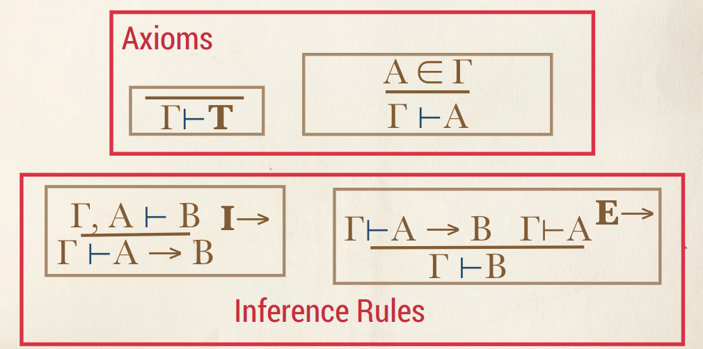
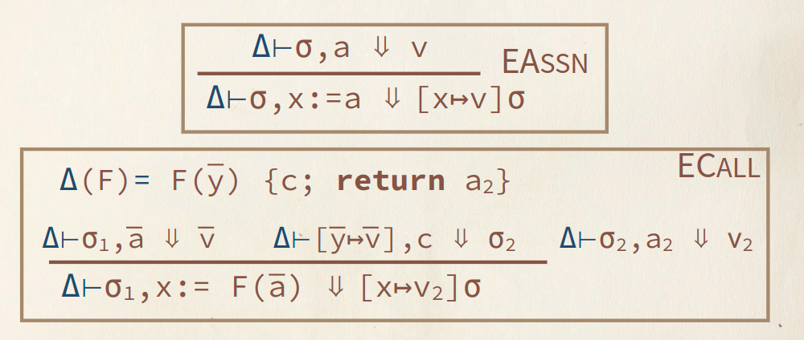
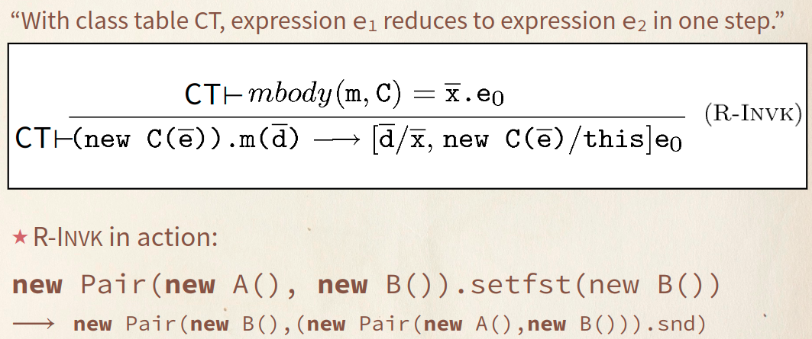
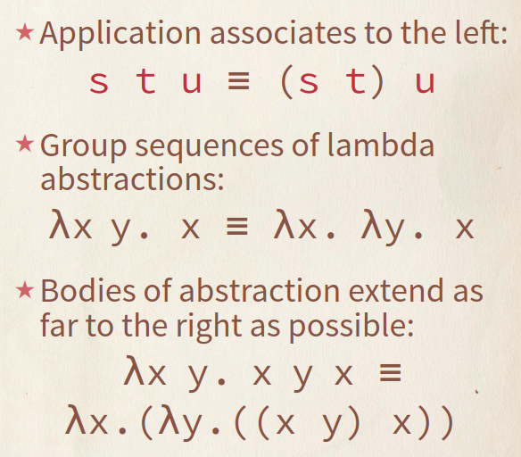
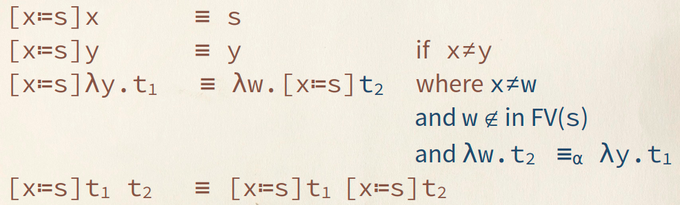

# Notes - Languages

## Polymorphism

- Parametric polymorphism
  - Generic in Java
  - Template in C++
- Subtyping polymorphism
  - Inheritance and polymorphism in OOP

## Inference Rules

## Coq vs. Math

- Functional Extensionality: `|- (forall x . f x = g x) --> f = g`
- Excluded Middle: `|- P or ~P`

## IMP with Function Definitions

## Featherweight Java R-Invk Rule

### 4 ways a FJ program can reach a normal form

- Becomes a value (no field accesses / method class remain)
- Attempts to access a field not declared for the class
- Attempts to invoke a method not declared for the class
- Attempts to cast to something other than a superclass of an object's runtime
  class

## Heap

- Use a total map to model heap.
- Use a partial map to model allocation.
- LJ: Each object has its own partial map to field values.

## Lambda Calculus

### Conventions

### Substitution

